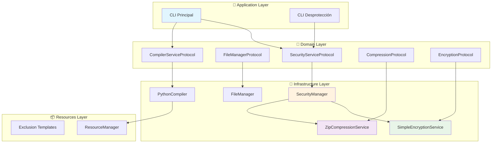
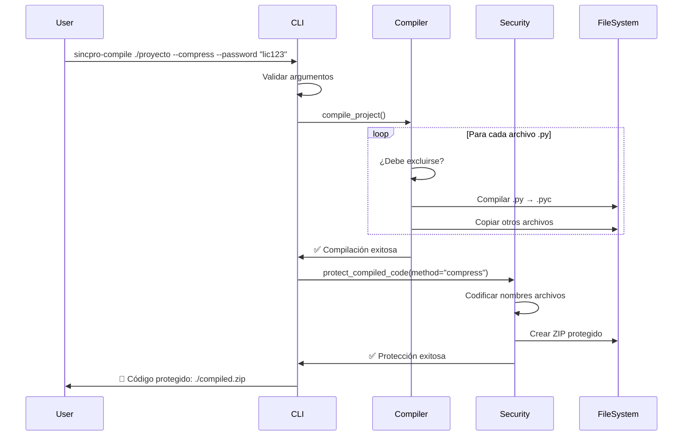
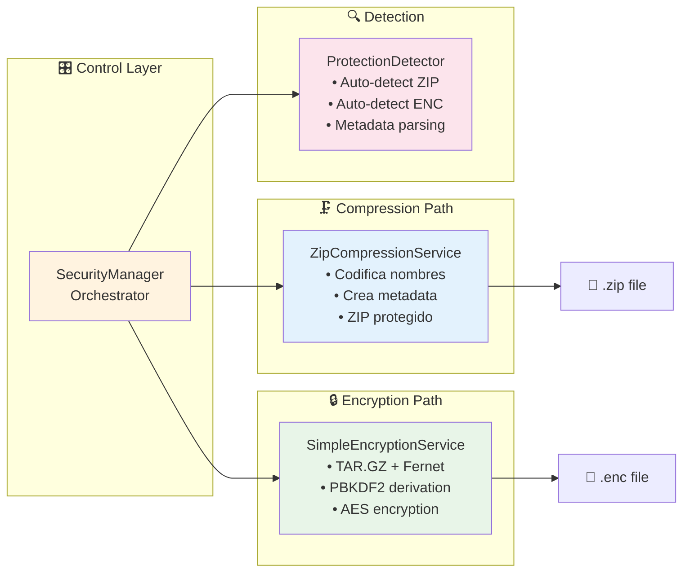
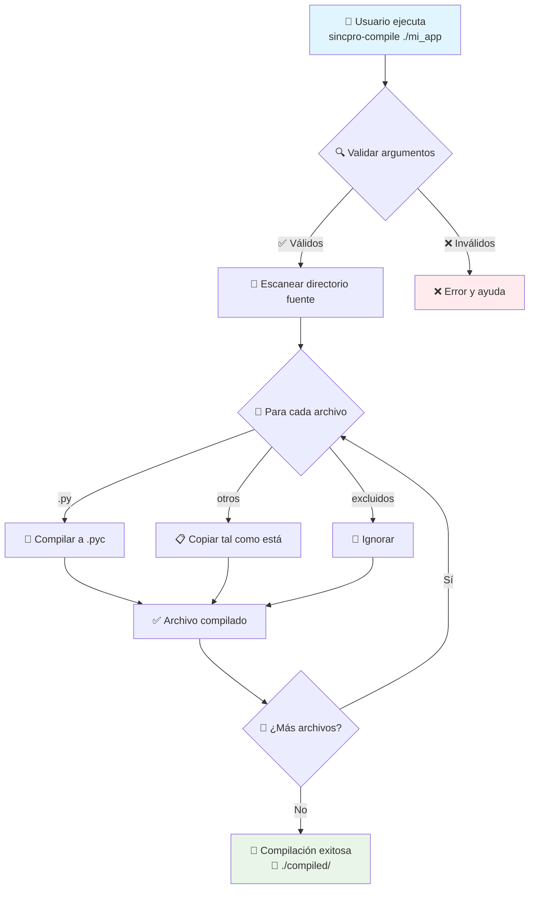
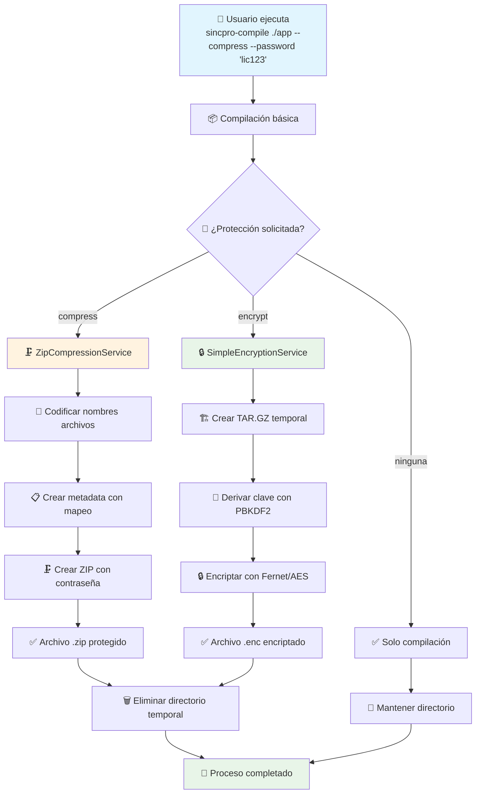
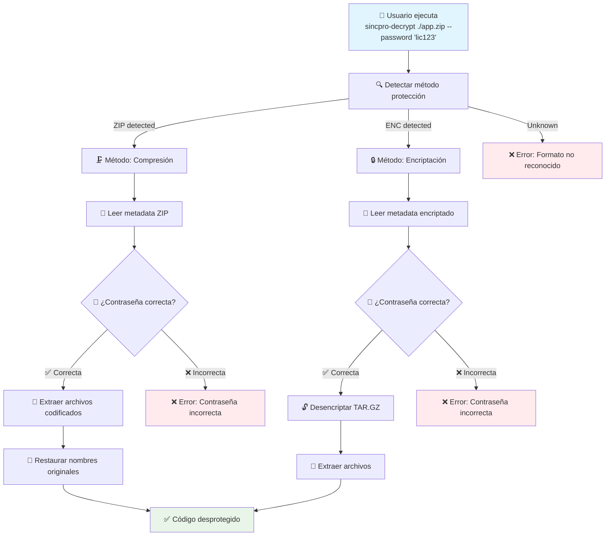
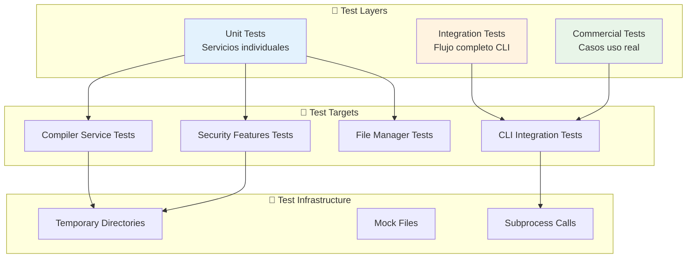
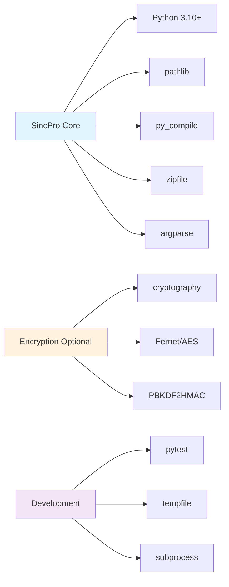
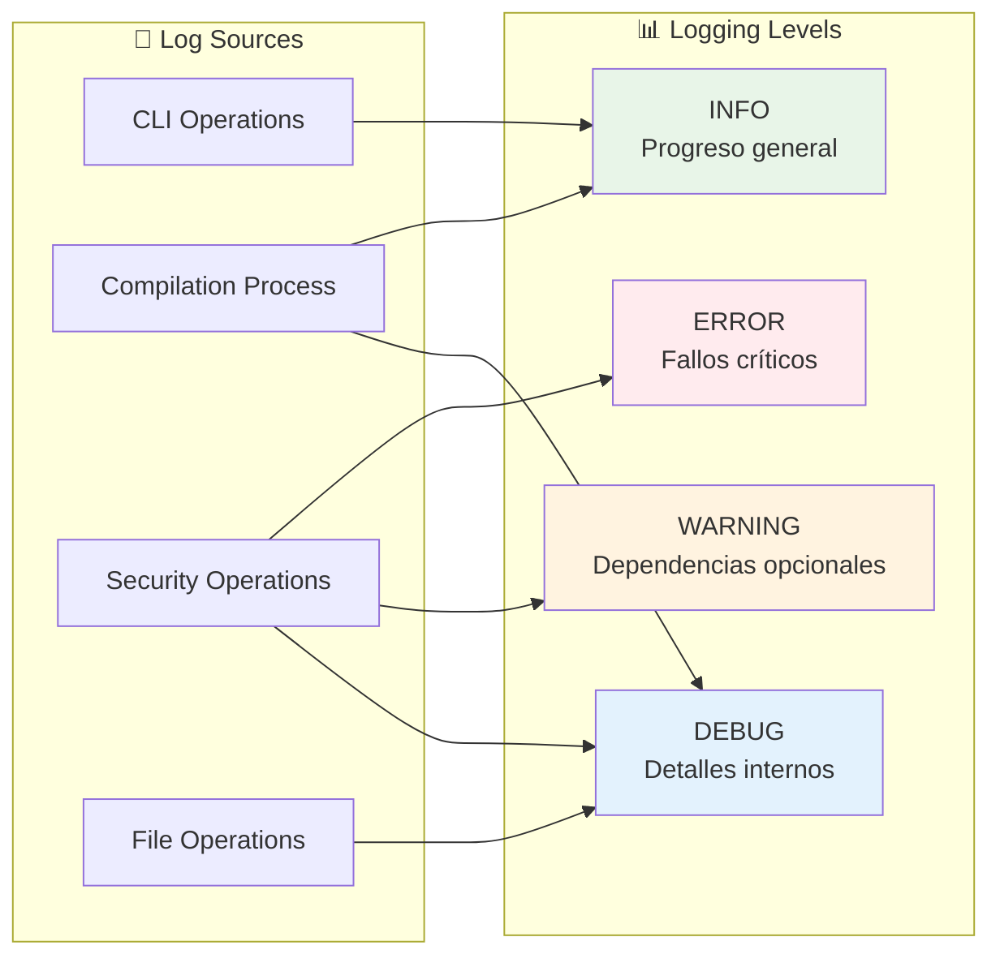
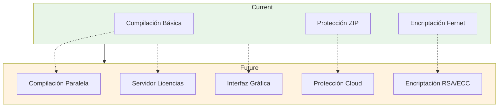

# Arquitectura de SincPro Python Compiler

## 📋 Visión General

SincPro Python Compiler implementa **Clean Architecture** con separación clara de responsabilidades, permitiendo compilar proyectos Python (.py → .pyc) y distribuir código protegido mediante compresión/encriptación con contraseña.

## 🏗️ Estructura General del Proyecto

## 📁 Matriz de Módulos y Responsabilidades

| 📂 Directorio/Módulo | 🎯 Propósito Principal | 📝 Descripción Detallada | 🔗 Dependencias |
|---------------------|------------------------|---------------------------|------------------|
| **`cli.py`** | Punto de entrada principal | Interface de línea de comandos que orquesta compilación y protección | `argparse`, `PythonCompiler`, `SecurityManager` |
| **`decrypt_cli.py`** | Desprotección de código | CLI especializado para desproteger archivos compilados | `argparse`, `SecurityManager` |
| **`domain/`** | Contratos y reglas de negocio | Define interfaces y protocolos sin implementación | Solo tipos de Python |
| **`domain/compiler_service.py`** | Protocolos de compilación | Interfaces para compilación y manejo de archivos | `typing.Protocol` |
| **`domain/security_service.py`** | Protocolos de seguridad | Interfaces para compresión y encriptación | `typing.Protocol` |
| **`infrastructure/`** | Implementaciones concretas | Servicios que implementan la lógica de negocio | Depende del dominio |
| **`infrastructure/python_compiler.py`** | Compilador Python | Compila .py a .pyc y maneja exclusiones | `py_compile`, `pathlib` |
| **`infrastructure/file_manager.py`** | Gestor de archivos | Operaciones de archivos y directorios | `shutil`, `pathlib` |
| **`infrastructure/security_manager.py`** | Orchestrador de seguridad | Coordina compresión y encriptación | `CompressionService`, `EncryptionService` |
| **`infrastructure/compression_service.py`** | Servicio de compresión | Compresión ZIP con protección por contraseña | `zipfile`, `hashlib` |
| **`infrastructure/encryption_service.py`** | Servicio de encriptación | Encriptación AES usando Fernet | `cryptography` (opcional) |
| **`resources/`** | Recursos estáticos | Templates y patrones de exclusión | - |
| **`resources/resource_manager.py`** | Gestor de recursos | Carga templates de exclusión | `pathlib` |
| **`tests/`** | Suite de pruebas | Tests unitarios e integración | `pytest`, `tempfile` |

## 🔄 Flujo de Ejecución Principal

## 🔐 Arquitectura del Sistema de Seguridad

## 📊 Matriz de Funcionalidades por Comando

| 🎯 Comando | 📝 Función | 🔧 Parámetros | 📤 Salida | 🔄 Flujo Interno |
|------------|------------|---------------|-----------|------------------|
| `sincpro-compile ./proyecto` | Compilación básica | `source`, `--output`, `--template` | Directorio con .pyc | CLI → Compiler → FileSystem |
| `sincpro-compile ./proyecto --compress --password "lic"` | Compilar + Comprimir | Básicos + `--compress`, `--password` | Archivo .zip protegido | CLI → Compiler → SecurityManager → ZipService |
| `sincpro-compile ./proyecto --encrypt --password "key"` | Compilar + Encriptar | Básicos + `--encrypt`, `--password` | Archivo .enc encriptado | CLI → Compiler → SecurityManager → EncryptionService |
| `sincpro-decrypt ./archivo.zip --password "lic" -o ./salida` | Desproteger ZIP | `source`, `--password`, `--output` | Directorio con .pyc | DecryptCLI → SecurityManager → ZipService |
| `sincpro-decrypt ./archivo.enc --password "key" -o ./salida` | Desencriptar | `source`, `--password`, `--output` | Directorio con .pyc | DecryptCLI → SecurityManager → EncryptionService |
| `sincpro-compile --list-templates` | Listar templates | `--list-templates` | Lista de templates | CLI → ResourceManager |

## 🎭 Escenarios de Uso Detallados

### 📦 Escenario 1: Compilación Básica

### 🔒 Escenario 2: Compilación con Protección

### 🔓 Escenario 3: Desprotección de Código

## 🔧 Lógica de Copias Fieles en la Infraestructura

El flujo de compilación en SincPro Python Compiler ahora incluye la capacidad de **copiar archivos y carpetas fielmente** según patrones definidos en cada template. Esta lógica está implementada en la capa de infraestructura (`PythonCompiler` y `CompilerService`).

- Los archivos y carpetas definidos como "copias fieles" en el template (por ejemplo, `odoo`) se copian tal cual al directorio de salida, sin ser compilados ni excluidos.
- El resto de archivos `.py` se compilan a `.pyc`.
- Los patrones de exclusión siguen aplicándose normalmente.

Esta funcionalidad permite mantener la integridad de archivos requeridos por frameworks como Odoo, facilitando la distribución y despliegue sin perder información esencial.

**Ejemplo:**

- Template `odoo`: Copia fiel de `__manifest__.py`, `__openerp__.py`, `static/`, `data/`, `demo/`, `security/`.
- Template `django`: Excluye carpetas como `migrations/`, `static/`, pero no realiza copias fieles por defecto.

La lógica puede ser extendida o personalizada editando los templates en `resources/exclude_patterns/`.

## 🧪 Arquitectura de Testing

## ⚙️ Configuración y Dependencias

### 📦 Dependencias Core

### 🎛️ Matriz de Configuración por Template

| 🏷️ Template | 📂 Tipo Proyecto | 🚫 Exclusiones Específicas | 📋 Casos de Uso |
|-------------|-------------------|----------------------------|------------------|
| **basic** | Proyecto Python estándar | `__pycache__/`, `.git/`, `.venv/`, `*.log` | Scripts, aplicaciones simples |
| **django** | Proyecto Django | Basic + `migrations/`, `static/`, `db.sqlite3` | Aplicaciones web Django |
| **odoo** | Addon Odoo | Basic + `__manifest__.py`, `security/`, `data/` | Módulos Odoo/OpenERP |
| **custom** | Proyecto personalizado | Definido por archivo `.sincpro_exclude` | Cualquier proyecto específico |

## 🔍 Monitoreo y Logging

## 🚀 Rendimiento y Escalabilidad

### 📈 Características de Rendimiento

| 🎯 Aspecto | 📊 Métrica | 🔧 Optimización | 📝 Notas |
|------------|------------|------------------|----------|
| **Compilación** | ~100 archivos/seg | Procesamiento secuencial | Limitado por I/O de disco |
| **Compresión** | ~50MB/seg | Nivel 6 ZIP | Balance compresión/velocidad |
| **Encriptación** | ~30MB/seg | AES hardware acelerado | Depende de cryptography |
| **Memoria** | <100MB típico | Streaming para archivos grandes | Sin cargar todo en RAM |
| **Concurrencia** | Secuencial actual | Potencial paralelización futura | Thread-safe por diseño |

### 🔮 Extensibilidad Futura

Esta arquitectura garantiza **mantenibilidad**, **extensibilidad** y **robustez** siguiendo principios SOLID y Clean Architecture, permitiendo evolucionar el sistema sin romper funcionalidades existentes.
