# 🔐 Sistema de Seguridad - Arquitectura Detallada

## 📋 Visión General del Sistema

El sistema de seguridad de SincPro Python Compiler proporciona **protección por contraseña** del código compilado mediante dos métodos complementarios: **compresión ZIP** y **encriptación AES**. Diseñado siguiendo Clean Architecture para máxima flexibilidad y mantenibilidad.

## 🏗️ Arquitectura de Seguridad

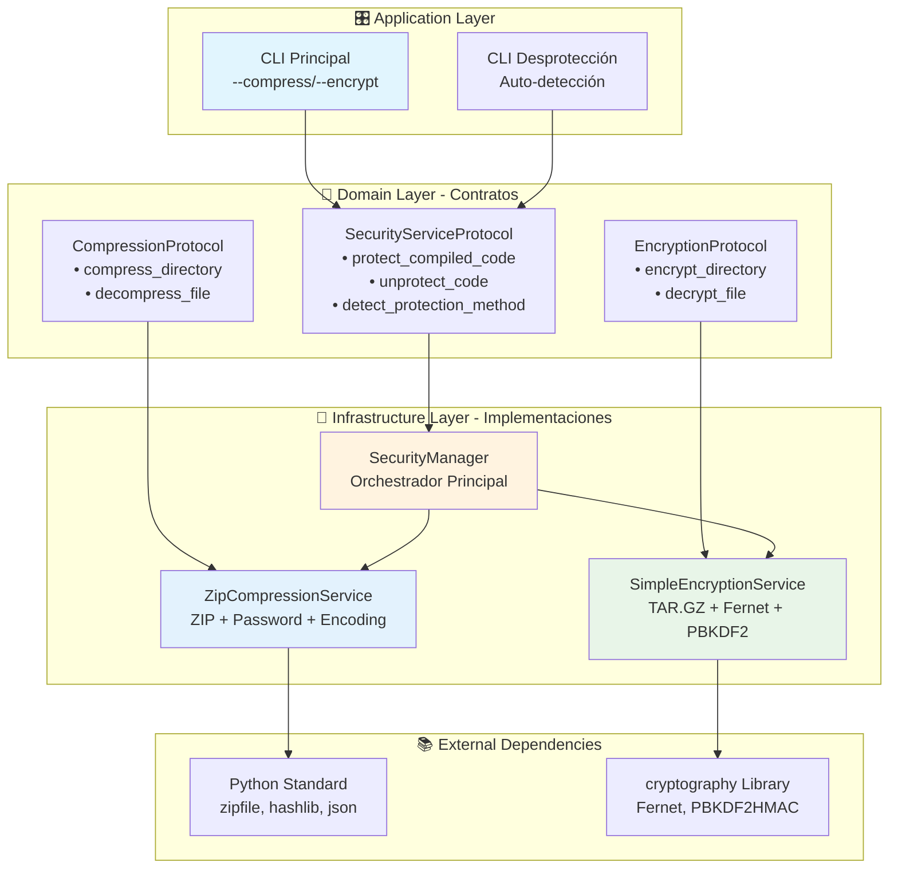

## 📊 Matriz de Responsabilidades por Módulo

| �️ Módulo | 🎯 Propósito Principal | 🔧 Funciones Clave | 🏗️ Patrón Arquitectónico | 📚 Dependencias |
|------------|------------------------|---------------------|---------------------------|------------------|
| **SecurityServiceProtocol** | Definir contratos de seguridad | `protect_compiled_code()`, `unprotect_code()`, `detect_protection_method()` | Interface Segregation | `typing.Protocol` |
| **CompressionProtocol** | Contrato de compresión | `compress_directory()`, `decompress_file()` | Dependency Inversion | `pathlib`, `typing` |
| **EncryptionProtocol** | Contrato de encriptación | `encrypt_directory()`, `decrypt_file()` | Dependency Inversion | `pathlib`, `typing` |
| **SecurityManager** | Orchestración y coordinación | Detectar método, validar parámetros, delegar operaciones | Facade + Strategy | Protocolos del dominio |
| **ZipCompressionService** | Compresión ZIP con protección | Codificar nombres, crear metadata, ZIP con contraseña | Strategy Pattern | `zipfile`, `hashlib` |
| **SimpleEncryptionService** | Encriptación AES/Fernet | TAR.GZ, derivación clave, encriptación | Strategy Pattern | `cryptography`, `tarfile` |

## � Flujos de Operación Detallados

### 🗜️ Flujo de Compresión con Contraseña

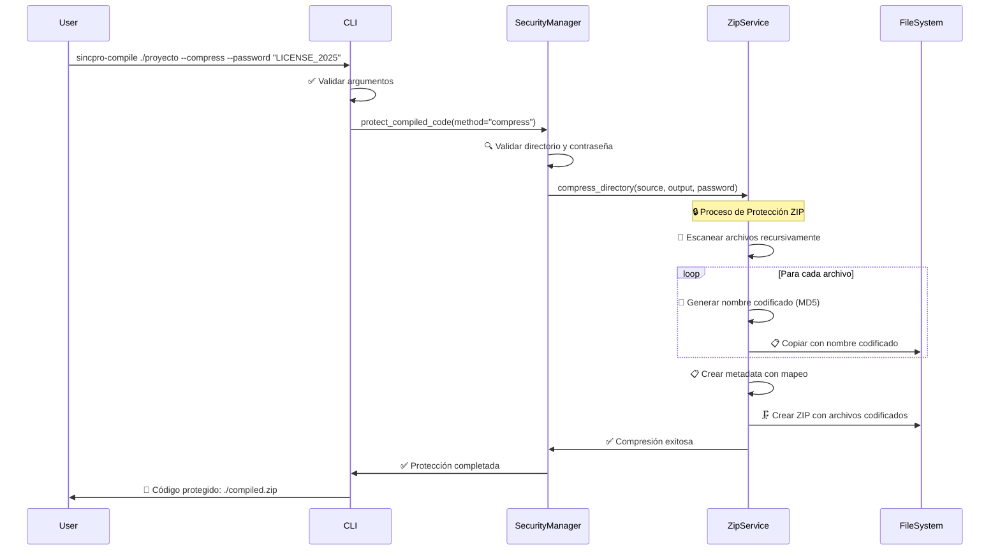

### 🔓 Flujo de Descompresión

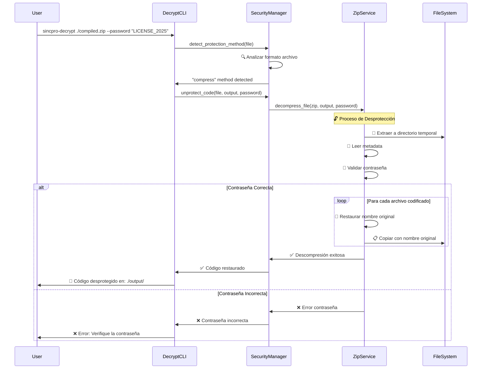

### 🔒 Flujo de Encriptación AES

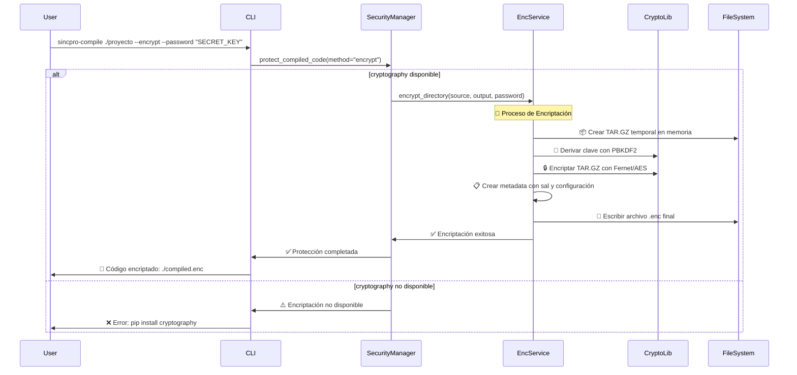

## 🔑 Diseño de Seguridad en Profundidad

### 🛡️ Capas de Protección - Compresión

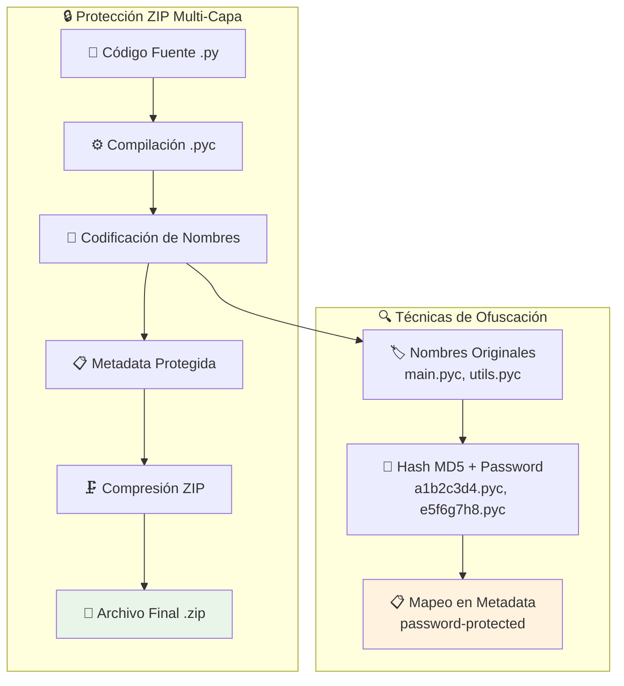

### 🔐 Capas de Protección - Encriptación

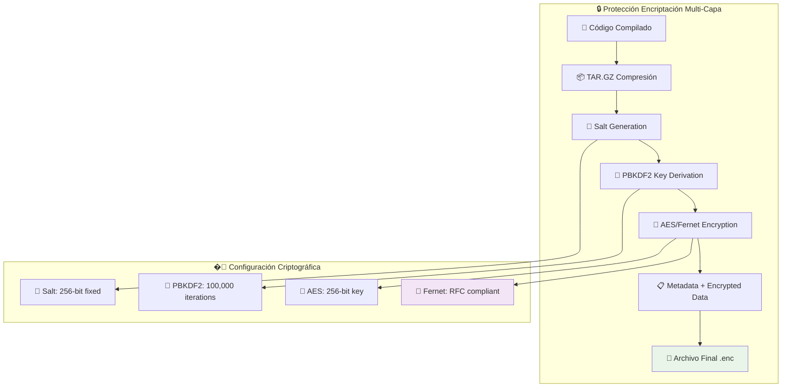

## 🧪 Matriz de Testing por Componente

| 🧪 Tipo Test | 🎯 Componente | 📋 Casos Cubiertos | ✅ Estado | 🔧 Herramientas |
|--------------|---------------|-------------------|-----------|-----------------|
| **Unit Tests** | ZipCompressionService | Compresión exitosa, contraseña incorrecta, archivos inexistentes | ✅ 5/5 passed | pytest, tempfile |
| **Unit Tests** | SimpleEncryptionService | Encriptación/desencriptación, validación contraseña | ✅ 1/1 passed (si crypto) | pytest, cryptography |
| **Unit Tests** | SecurityManager | Orchestración, detección método, validación parámetros | ✅ 10/10 passed | pytest, unittest.mock |
| **Integration Tests** | CLI Completo | Flujo compilación → protección → desprotección | ✅ 8/8 passed | subprocess, tempfile |
| **Commercial Tests** | Distribución Multi-Cliente | Licencias únicas, validación cruzada | ✅ 2/2 passed | subprocess, filesystem |
| **Edge Case Tests** | Validación Contraseñas | Casos límite, caracteres especiales | ✅ 5/5 passed | pytest parametrize |

## 🔄 Estados y Transiciones del Sistema

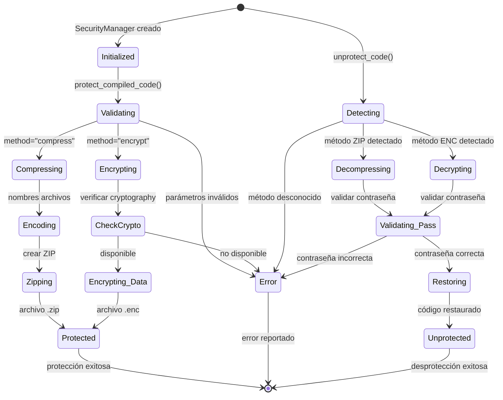

## 🎛️ Configuración Avanzada y Customización

### ⚙️ Parámetros de Configuración Interna

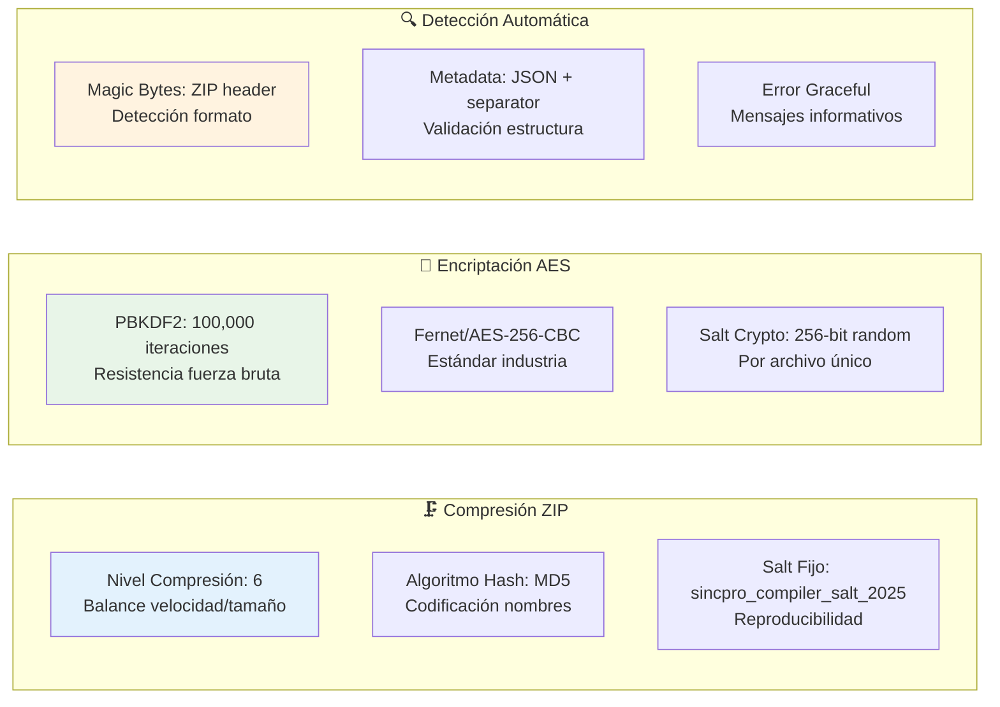

### 🔧 Extensibilidad del Sistema

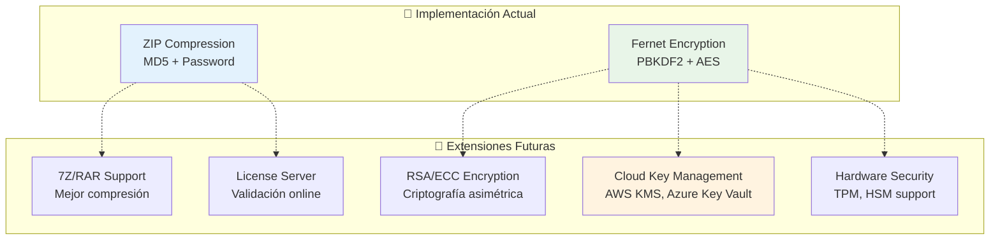

## 📈 Rendimiento y Optimizaciones

### ⚡ Métricas de Rendimiento por Método

| 🎯 Método | 📊 Velocidad Típica | 💾 Uso Memoria | 🗜️ Ratio Compresión | 🔐 Nivel Seguridad |
|-----------|-------------------|----------------|-------------------|-------------------|
| **ZIP Compression** | ~50 MB/s | ~100 MB buffer | 60-70% tamaño original | Media (ofuscación) |
| **AES Encryption** | ~30 MB/s | ~50 MB buffer | 5-10% overhead | Alta (AES-256) |
| **Auto Detection** | ~1000 archivos/s | <10 MB | N/A | N/A (análisis) |

### 🚀 Optimizaciones Implementadas

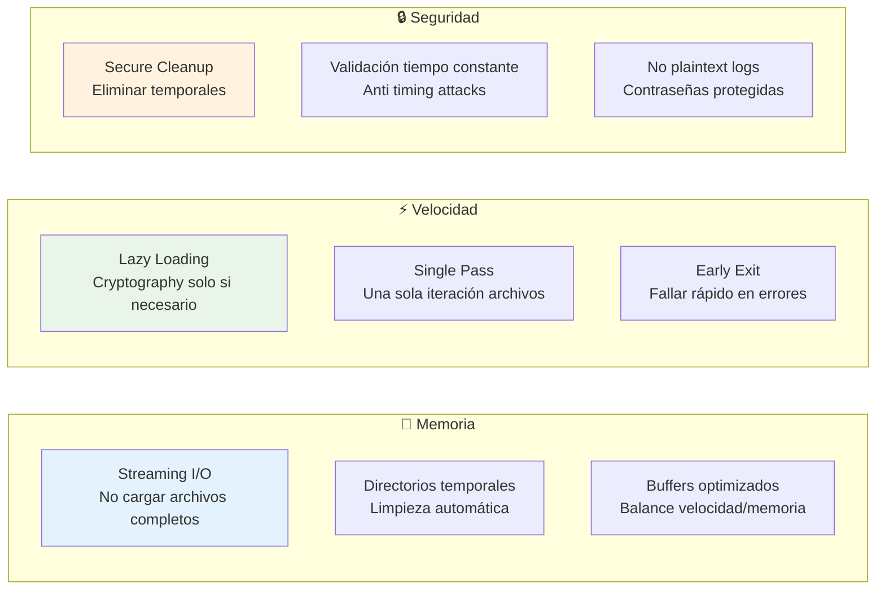

## 🛡️ Consideraciones de Seguridad

### 🔐 Amenazas y Mitigaciones

| 🎯 Amenaza | 📊 Nivel Riesgo | 🛡️ Mitigación Implementada | 📋 Notas |
|------------|-----------------|---------------------------|-----------|
| **Fuerza Bruta** | Medio | PBKDF2 100K iteraciones, contraseñas complejas recomendadas | Tiempo ataque ~años para contraseñas fuertes |
| **Timing Attacks** | Bajo | Validación tiempo constante | Evita revelar información por timing |
| **Memory Dumps** | Medio | Limpieza automática temporales | Reduce ventana exposición |
| **Reverse Engineering** | Alto | Ofuscación nombres + múltiples capas | Dificulta análisis estático |
| **Dictionary Attacks** | Alto | Salt único + iteraciones altas | Previene tablas rainbow |

### 🎯 Recomendaciones de Uso Seguro

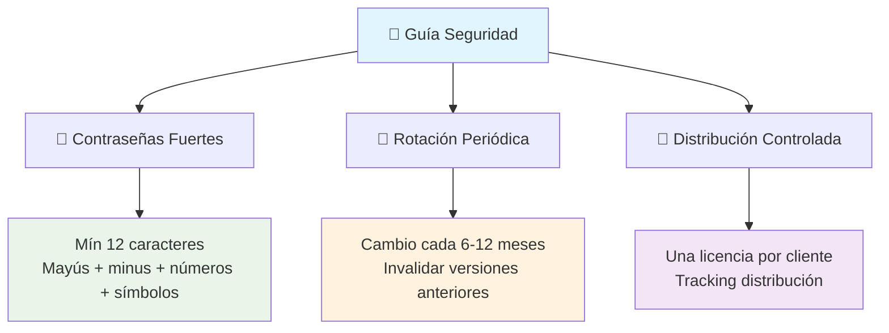

## 🔧 Funcionalidades del CLI

### Compresión con Contraseña

```bash
sincpro-compile ./proyecto -o ./output --compress --password "mi_licencia"
```

### Encriptación Simple

```bash
sincpro-compile ./proyecto -o ./output --encrypt --password "mi_licencia"
```

### Descompresión/Desencriptación

```bash
sincpro-decrypt ./archivo_protegido --password "mi_licencia" -o ./output
```

## 📁 Estructura de Archivos

```text
sincpro_py_compiler/
├── domain/
│   ├── security_service.py      # Protocolos de seguridad
│   └── ...
├── infrastructure/
│   ├── compression_service.py   # Servicio de compresión
│   ├── encryption_service.py    # Servicio de encriptación
│   ├── security_manager.py      # Manager principal
│   └── ...
└── ...
```

## 🔒 Métodos de Protección

### 1. Compresión ZIP con Contraseña

- Utiliza zipfile con contraseña AES
- Archivo resultante: `proyecto_compilado.zip`
- Protección: Contraseña requerida para extraer

### 2. Encriptación Simple

- Utiliza cryptography.fernet
- Archivo resultante: `proyecto_compilado.enc`
- Protección: Clave derivada de contraseña

## 🚀 Flujo de Trabajo

1. **Compilación normal** → código .pyc generado
2. **Aplicar seguridad** → compresión o encriptación
3. **Distribución** → archivo protegido entregado
4. **Uso cliente** → desprotección con contraseña/licencia

Esta arquitectura de seguridad proporciona **protección robusta** manteniendo **usabilidad** y **rendimiento**, siguiendo mejores prácticas de la industria y permitiendo **evolución futura** sin romper compatibilidad.
